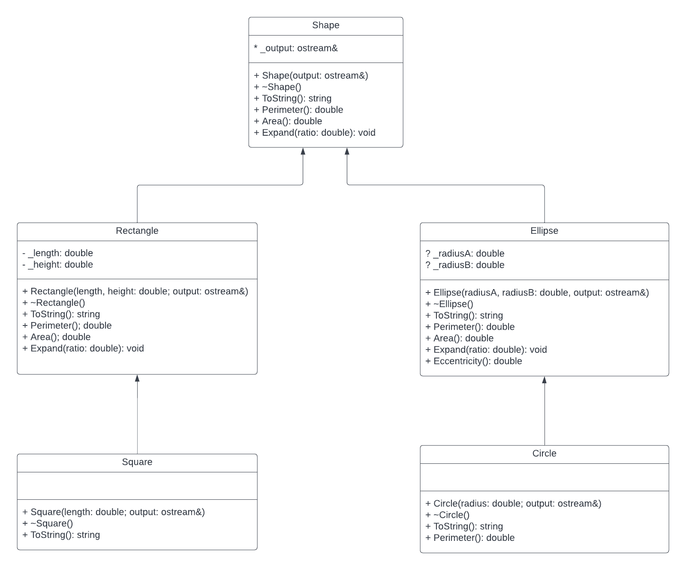

# Inheritance

Due to time constraints, the instructions will be brief.

## Class Design


You are to create five classes following the inheritance shown in the diagram above. The classes are:
* Shape
* Ellipse
* Circle
* Rectangle
* Square

A brief description of each of the classes follows.

### Shape
Characteristics:
* Base class.
* Abstract class.
* Implements: 
  * Constructor, it should output `Shape Constructor` to the `_output` data member.
  * Destructor, it should output `Shape Destructor` to the `_output` data member.
  * `ToString` method should return a string like the following: `Shape @ 0x11110000ae12` where the hex number is the address of the object calling the method.
* Only one data member `_output` its access is `protected`

You must correctly decide:
- What methods are `const`?
- What methods are `virtual`?
- What methods are `virtual` pure?


### Ellipse
Characteristics:
* Derived class from Shape
* Two data members, you will need to decide the type of access for these data members:
  - `_radiusA` represents one axis
  - `_radiusB` represents the other axis
* The constructor should output `Ellipse Constructor` to the `_output` data member.
* The destructor should output `Ellipse Destructor` to the `_output` data member.
* The `ToString()` method should return a string like the following: `{Shape: Ellipse, Radius A: 2.0, Radius B: 1.5}`

You must correctly decide:
- What methods are `const`?
- What methods are `virtual`?
- What methods are `virtual` pure?
- What methods need to have the `override` flag?


### Circle
Characteristics:
* Derived class from Ellipse
* No additional data members.
* The constructor should output `Circle Constructor` to the `_output` data member.
* The destructor should output `Circle Destructor` to the `_output` data member.
* The `ToString()` method should return a string like the following: `{Shape: Circle, {Shape: Ellipse, Radius A: 2.0, Radius B: 1.5}}`

You must correctly decide:
- What methods are `const`?
- What methods are `virtual`?
- What methods are `virtual` pure?
- What methods need to have the `override` flag?

> You will need to override the method `Perimeter`, notice the difference on the formulas to calculate this for Ellipse and for Circle.


### Rectangle
Characteristics:
* Derived class from Shape
* Two data members, you will need to decide the type of access for these data members:
  - `_radiusA` represents the base of the rectangle
  - `_radiusB` represents the height of the rectangle
* The constructor should output `Rectangle Constructor` to the `_output` data member.
* The destructor should output `Rectangle Destructor` to the `_output` data member. 
* The `ToString()` method should return a string like the following: `{Shape: Rectangle, Height A: 2.0, Length: 1.5}`

You must correctly decide:
- What methods are `const`?
- What methods are `virtual`?
- What methods are `virtual` pure?
- What methods need to have the `override` flag?

### Square
Characteristics:
* Derived class from Rectangle
* No additional data members.
* The constructor should output `Square Constructor` to the `_output` data member.
* The destructor should output `Square Destructor` to the `_output` data member.
* The `ToString()` method should return a string like the following: `{Shape: Square, {Shape: Rectangle, Height A: 2.0, Length: 1.5}}`

You must correctly decide:
- What methods are `const`?
- What methods are `virtual`?
- What methods are `virtual` pure?
- What methods need to have the `override` flag?

## Additional Directions
* You should not change anything on the following files:
  * `test_functions.h` (you may lose 90% of your grade if you do)
  * `main.cpp` (you may lose 90% of your grade if you do)
  * You will need to implement the functions declared on `test_functions.h` that need to be defined on `test_functions.cpp`:
     ```c++
     // returns how many squares are in the vector
     int CountSquares(const vector<Shape*>& list);
     // returns how many rectangles are in the vector
     int CountRectangles(const vector<Shape*>& list);
     // returns how many circles are in the vector
     int CountCircles(const vector<Shape*>& list);
     // returns how many ellipses are in the vector
     int CountEllipses(const vector<Shape*>& list);
     // returns how many ellipses are in the vector that are specifically
     // ellipses (not circles).
     int CountSpecificEllipses(const vector<Shape*>& list);
     // returns how many rectangles are in the vector that are specifically
     // rectangles (not squares).
     int CountSpecificRectangles(const vector<Shape*>& list);
     // returns the eccentricity of the ellipse supposed to be in the position
     // index of the vector. Sets error to true if the element in that position
     // is not an ellipse.
     double GetEccentricity(const vector<Shape*>& list, unsigned int index, bool& error);
     ```
  * Remember to 'activate' the inheritance, if correctly done the compilation errors on `main.cpp` should disappear. Why?

## Extra Credit

Add two additional classes: `Triangle` and `EquilateralTriangle`. This classese should have the Constructor and Destructor following the same pattern as the other classes, same applies to the `ToString` method.

Once created these classes, create three new files:
* `main_extra.cpp` will contain your `main` function but a modified `Test` function that will include tests for your `Triangle` and `EquilateralTriangle` classes. Follow the pattern of tests of the original `Test` function.
* `test_functions_extra.h` will contain declarations for the following functions
   ```c++
    int CountTriangles(const vector<Shape*>& list);
    int CountEquilateralTriangles(const vector<Shape*>& list);
    int CountSpecificTriangles(const vector<Shape*>& list);
   ```
* `test_functions_extra.cpp` will contain the definitions of the previous functions.

Remember that your `Test` function in `main.cpp` must call these three functions. The extra credit will only be considered if the assigned tests are passed successfully.


## Expected Output

```
TEST PASSED (Square Constructor                      ) Total Passed: 1
TEST PASSED (Circle Constructor                      ) Total Passed: 2
TEST PASSED (Ellipse Constructor                     ) Total Passed: 3
TEST PASSED (Rectangle Constructor                   ) Total Passed: 4
TEST PASSED (Circle Constructor                      ) Total Passed: 5
TEST PASSED (Square Constructor                      ) Total Passed: 6
TEST PASSED (Rectangle Constructor                   ) Total Passed: 7
TEST PASSED (Circle Constructor                      ) Total Passed: 8
TEST PASSED (Ellipse Constructor                     ) Total Passed: 9
TEST PASSED (Ellipse Constructor                     ) Total Passed: 10
TEST PASSED (Count Ellipses                          ) Total Passed: 11
TEST PASSED (Count Circles                           ) Total Passed: 12
TEST PASSED (Count Rectangles                        ) Total Passed: 13
TEST PASSED (Count Squares                           ) Total Passed: 14
TEST PASSED (Count Specific Ellipses                 ) Total Passed: 15
TEST PASSED (Count Specific Rectangles               ) Total Passed: 16
TEST PASSED (Calculate Eccentricity #1               ) Total Passed: 17
TEST PASSED (Calculate Eccentricity #2.1             ) Total Passed: 18
TEST PASSED (Calculate Eccentricity #2.2             ) Total Passed: 19
TEST PASSED (Calculate Eccentricity #3.1             ) Total Passed: 20
TEST PASSED (Calculate Eccentricity #3.2             ) Total Passed: 21
TEST PASSED (Calculate Eccentricity #4               ) Total Passed: 22
TEST PASSED (Calculate Eccentricity #5.1             ) Total Passed: 23
TEST PASSED (Calculate Eccentricity #5.2             ) Total Passed: 24
TEST PASSED (Calculate Eccentricity #6               ) Total Passed: 25
TEST PASSED (Calculate Eccentricity #7               ) Total Passed: 26
TEST PASSED (Calculate Eccentricity #8.1             ) Total Passed: 27
TEST PASSED (Calculate Eccentricity #8.2             ) Total Passed: 28
TEST PASSED (Calculate Eccentricity #9.1             ) Total Passed: 29
TEST PASSED (Calculate Eccentricity #9.2             ) Total Passed: 30
TEST PASSED (Calculate Eccentricity #10.1            ) Total Passed: 31
TEST PASSED (Calculate Eccentricity #10.2            ) Total Passed: 32
TEST PASSED (Square Destructor                       ) Total Passed: 33
TEST PASSED (Circle Destructor                       ) Total Passed: 34
TEST PASSED (Ellipse Destructor                      ) Total Passed: 35
TEST PASSED (Rectangle Destructor                    ) Total Passed: 36
TEST PASSED (Circle Destructor                       ) Total Passed: 37
TEST PASSED (Square Destructor                       ) Total Passed: 38
TEST PASSED (Rectangle Destructor                    ) Total Passed: 39
TEST PASSED (Circle Destructor                       ) Total Passed: 40
TEST PASSED (Ellipse Destructor                      ) Total Passed: 41
TEST PASSED (Ellipse Destructor                      ) Total Passed: 42
= = = END OF MAIN = = =

```

## Grading Rubric

There are 42 tests that your code needs to pass. If a test is failed, then the message will appear there and that test will not be counted towards the total test passed. Your "gross" grade will be the number of tests you passed divided by 42 times 100.

Remember that you are expected to follow the good programming practices and course coding conventions. See the Deductions section for details on the issues that may reduce your gross grade.

### Deductions

* For each infraction on good programming practices there will be a deduction of 10 points
* If the program has a runtime error (the program crashes) there will be a deduction of 15 points
* If the program does not have comment headers there will be a deduction of 10 points
* If the program does not have comments on functions and appropriate additional comments there will be a deduction of 5 points
* If the program does not follow instructions, for instance if you did not implement any of the requested functions, there will be a deduction of 5 points per ignored instruction
* If the program does not compile, the grade will be zero.

### Grading yourself

It is possible, and encouraged that you grade your own assignment. The steps to grade your assignment:
1. Make sure your code compile, if it doesn't you will not receive credit for this assignment.
2. Run the program using the provided `main.cpp`
3. Calculate your gross grade using the formula provided above
4. Check that your code follows the programming guidelines
    1. Is your code following the identifier naming conventions?
    2. Is your code appropriately indented?
    3. Does your code avoid using global variables?
    4. Does your code use a consistent style of {}?
    5. Are all your identifiers using meaningful names?
    6. Are all non-primitive type parameters passed by reference and const when needed?
    7. Is your code clean?
    8. Does your code avoid using `cout` or `cin` inside functions or methods that are not supposed to have console input or output?
    9. Does your program run smoothly? (Your code doesn't crash)
    10. Does your code have all the header comments?
    11. Do all your methods have the `const` or `virtual` or `override` modifier as appropriate?
    12. If your answer to all the above questions is yes, then you are unlikely to lose any points and your assignment final grade should be very close to the gross grade.

A warning: hard-coding your output will result in a zero grade!

## Academic Integrity

This programming assignment is to be done on an individual basis. At the same time, it is understood that learning from your peers is valid, and you are encouraged to talk among yourselves about programming in general and current assignments in particular. Keep in mind, however, that each individual student must do the work in order to learn.

Hence, the following guidelines are established:

* Feel free to discuss any and all programming assignments but do not allow other students to look at or copy your code. Do not give any student an electronic or printed copy of any program you write for this class.
* Gaining the ability to properly analyze common programming errors is an important experience. Do not deprive a fellow student of his/her opportunity to practice problem solving: control the urge to show them what to do by writing the code for them.
* If you’ve given the assignment a fair effort and still need help, see the instructor or a lab assistant.
* If there is any evidence that a program or other written assignment was copied from another student (or from any source), neither student will receive any credit for it. This rule will be enforced.
* Protect yourself: Handle throw-away program listings carefully.
* Remember to read the Academic Integrity guidelines provided in the class syllabus.
